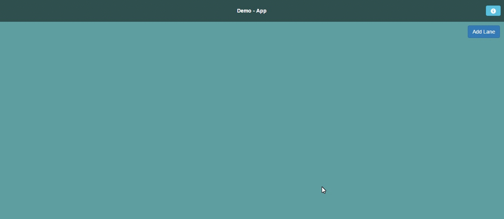

# angular2-trello
A simple demo app like Trello using Angular2

## Setup
1. `git clone https://github.com/jumpbytehq/angular2-trello.git`
2. `npm install`

## Directions to use
1. build using `npm run build`
2. start app using `npm run server`

## Demo

